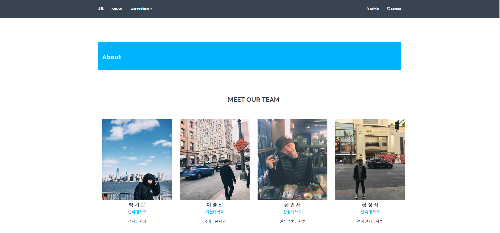

# # JS site
팀프로젝트 공유 페이지

## # JS site page



## # 개요

  - 두번의 프로젝트 후 프로젝트들을 소개하는 역할을 합니다.
  - 기획서, 보고서, 동영상 등을 통해 프로젝트를 설명해줍니다.

## # 주요기능

* 메인화면
  - 사이트는 회원만 접속 가능하며 로그인 화면을 먼저 접합니다.
  - 로그인 이후 프로젝트 과정에서 있었던 사진들을 썸네일 형식으로 메인 화면에서 보여줍니다.
  - 회원은 누구나 사진을 올릴 수 있으며 자신이 올린 사진을 지울 수 있고 관리자는 모든 사진에 대해 삭제권한이 있습니다.
  
* 회원가입 및 로그인
  - 장고 기본 로그인 회원가입 형식을 사용했습니다.
  
* Photo
  - 사진 업로드 시 public 선택 란이 있습니다.
  - public을 선택하면 메인화면에서 사진을 볼 수 있고 선택하지 않을 시 자신의 Profile 화면에서 사진이 보여집니다.
  - 모든 사진과 사진에 대한 글은 수정, 삭제가 가능합니다.
  - 사진에는 댓글을 달 수 있습니다.
  
  ```
  // models.py
  class Photo(models.Model):
    image = ImageField(upload_to = user_path)
    owner = models.ForeignKey(
        settings.AUTH_USER_MODEL,
        on_delete=models.CASCADE,)
    title = models.CharField(max_length = 255, default='')
    pub_date = models.DateTimeField(auto_now_add = True)
    is_public = models.BooleanField(default=False) 

    def __str__(self):
        return '{} {} {}'.format(self.owner.username, self.title, self.is_public)
    ```

    ```
    // views.py -> public이 선택된 사진만 모델에서 불러옴.
    photo_list = Photo.objects.filter(is_public=True)[:20]
    ```  
  
* Profile
  - 개인적인 공간으로 개인적인 프로젝트에 대한 사진이나 글을 작성할 수 있습니다.

* Project
  - 상단 메뉴바를 통해 볼 수 있습니다.
  - 보고서와 PPT를 슬라이드 형식으로 만들어 넘기면서 확일 할 수 있습니다.
  - 동영상 썸네일을 누르면 프로젝트를 소개하는 영상을 확인 할 수 있습니다.
  

